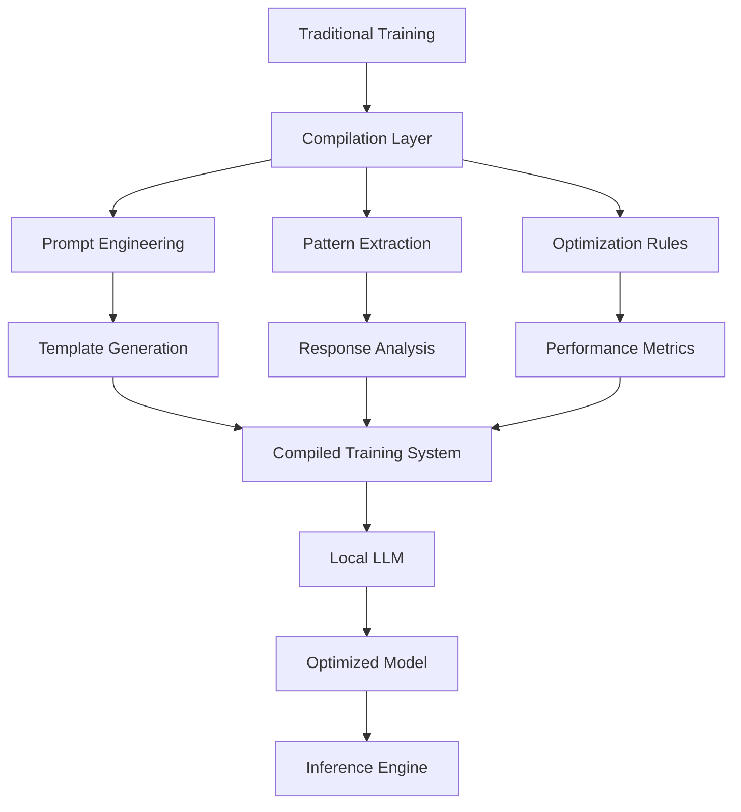
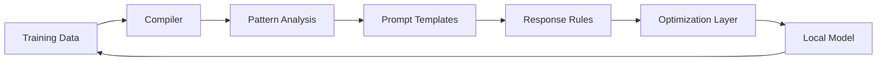

# 🧠 LLM Training Compiler - A Novel Approach to Local Language Model Training
> Transform traditional epoch-based training into compiled prompt systems for efficient LLM tuning

## Revolutionary Training Paradigm



## What Makes This Different

Traditional LLM training requires massive computational resources and direct model weight adjustments. Our approach introduces a compilation layer that transforms conventional training patterns into optimized prompt systems.

### The Compilation Advantage



## 🎯 Features

### Core Capabilities
- **Advanced Decision Making Engine**
  - Real-time hand strength evaluation using Treys library
  - Position-based strategy optimization with DSPy
  - Dynamic opponent modeling through machine learning
  - Stack-size aware decisions with ICM considerations
  - Pot odds and implied odds calculations in real-time
  - Multi-street planning and hand reading
  - Range-based decision making

### Training Framework
- **Multi-Modal Learning System**
  - Supervised learning from expert gameplay
  - Reinforcement learning through self-play
  - Adversarial training against varied opponents
  - Real-time adaptation to opponent tendencies

### Analysis Tools
- **Performance Metrics**
  - Win rate tracking
  - Expected Value (EV) calculations
  - Decision quality assessment
  - Bluff efficiency analysis
  - Position-based performance metrics

### Customization Options
- **Training Parameters**
  - Learning rate adjustment
  - Batch size optimization
  - Temperature scaling
  - Early stopping criteria
  - Validation intervals

## 🛠 Advanced Customization

### Custom Hand Evaluator
```python
from poker_bot.hand_evaluator import HandEvaluator

class MyHandEvaluator(HandEvaluator):
    def calculate_hand_strength(self, cards):
        # Custom strength calculation
        strength = super().calculate_hand_strength(cards)
        # Add position-based adjustments
        return strength * self.position_multiplier()
```

### Custom Opponent Model
```python
from poker_bot.opponent_model import OpponentModel

class MyOpponentModel(OpponentModel):
    def analyze_opponent(self, history):
        tendencies = {
            'aggression': self.calculate_aggression(history),
            'bluff_frequency': self.detect_bluffs(history),
            'position_plays': self.analyze_position_play(history)
        }
        return self.generate_counter_strategy(tendencies)
```

## 🚀 Deployment

### Model Export
```python
# Export trained model
trainer.export_model('my_poker_model.pkl')
```

### API Integration
```python
from poker_bot import PokerAPI

api = PokerAPI(model_path='my_poker_model.pkl')
api.start(port=8000)
```

### Docker Deployment
```bash
# Build container
docker build -t poker-bot .

# Run API server
docker run -p 8000:8000 poker-bot
```

## 🚀 Quick Start

### Installation
```bash
# Clone the repository
git clone https://github.com/yourusername/poker-ai-trainer.git

# Navigate to project directory
cd poker-ai-trainer

# Install dependencies
./poker/start.sh
```

### Basic Usage
```python
# Start training session
train

# Run hyperparameter tuning
tune

# Load specific checkpoint
load-checkpoint

# View training history
training-history
```

## 🎓 Training Tutorial

### 1. Understanding the Architecture

The system uses a multi-layered approach to poker decision making:
```python
class PokerAgent(dspy.Module):
    def __init__(self):
        self.hand_evaluator = HandEvaluator()
        self.opponent_model = OpponentModel()
        self.position_strategy = PositionStrategy()
```

### 2. Configuring Training Parameters

Optimize your training with custom configurations:
```python
config = TrainingConfig(
    num_epochs=1000,
    batch_size=32,
    learning_rate=0.001,
    validation_interval=50,
    patience=10,
    temperature=0.7
)
```

### 3. Data Generation & Augmentation

Create diverse training scenarios:
```python
def prepare_training_data():
    # Generate balanced hand distributions
    # Create multi-street scenarios
    # Vary stack sizes and positions
    return train_data, valid_data
```

## 🛠 Advanced Customization

### Game Theory Integration
- Implement Nash Equilibrium solvers
- Add range-based decision making
- Incorporate ICM modeling for tournaments

### Custom Evaluation Metrics
```python
class CustomEvaluator(PokerEvaluator):
    def __init__(self):
        self.metrics.extend([
            "fold_equity",
            "range_advantage",
            "stack_leverage"
        ])
```

### Opponent Modeling
```python
class OpponentModel:
    def analyze_opponent(self, history):
        # Pattern recognition
        # Tendency analysis
        # Exploit identification
```

## 📊 Performance Optimization

### 1. Hyperparameter Tuning
```python
param_grid = {
    'learning_rate': [0.001, 0.01, 0.1],
    'batch_size': [16, 32, 64],
    'temperature': [0.5, 0.7, 0.9]
}
```

### 2. Model Architecture Optimization
- Layer configuration
- Attention mechanisms
- Residual connections

### 3. Training Efficiency
- Batch processing
- GPU acceleration
- Distributed training

## 🔍 Monitoring & Analysis

### Training Metrics
- Loss curves
- Accuracy trends
- Validation performance
- Overfitting detection

### Performance Analysis
```python
class PerformanceAnalyzer:
    def analyze_session(self):
        # Win rate by position
        # Action distribution
        # EV analysis
        # Bluff success rate
```

## 🎮 Demo Mode

Practice and validate strategies:
```python
demo = DemoMode()
demo.simulate_game(
    opponent_level='expert',
    num_hands=100
)
```

## 🔧 Troubleshooting

Common issues and solutions:
- Training convergence problems
- Overfitting symptoms
- Memory optimization
- Performance bottlenecks

## 📚 Additional Resources

- [Poker Game Theory Fundamentals](link)
- [Advanced Training Techniques](link)
- [DSPy Documentation](link)
- [Community Forums](link)

## 🗺 Roadmap

### Upcoming Features
- Multi-table tournament support
- Real-time opponent modeling
- Advanced ICM calculations
- Hand range visualization
- Integration with popular poker platforms

### In Development
- Mobile client application
- Cloud training infrastructure
- Collaborative training framework

## 🤝 Contributing

### Issue Reporting
- Use the issue template
- Include hand histories when relevant
- Provide system information

### Pull Request Guidelines
- Follow PEP 8 style guide
- Include unit tests
- Update documentation
- Add to CHANGELOG.md

### Code Style
- Use type hints
- Document complex algorithms
- Follow project structure
- Include docstrings

## 📄 License

This project is licensed under the MIT License - see the [LICENSE](LICENSE) file for details.

## 🌟 Acknowledgments

- DSPy team for the core framework
- Poker theory contributors
- Community feedback and testing

---

For detailed documentation, visit our [Wiki](wiki-link).
For support, join our [Discord Community](discord-link).
