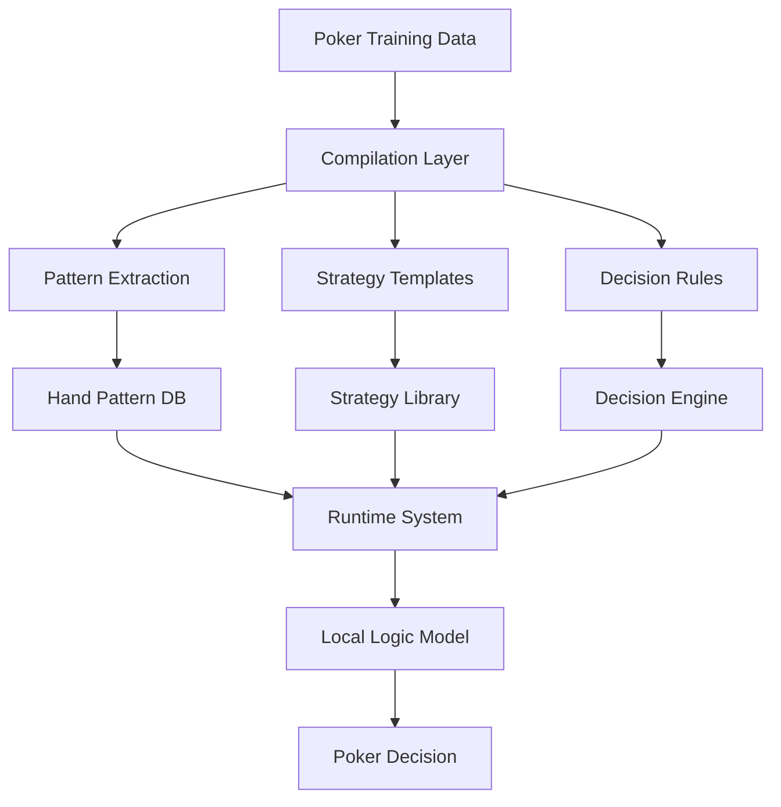
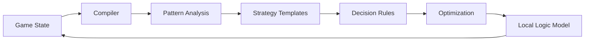
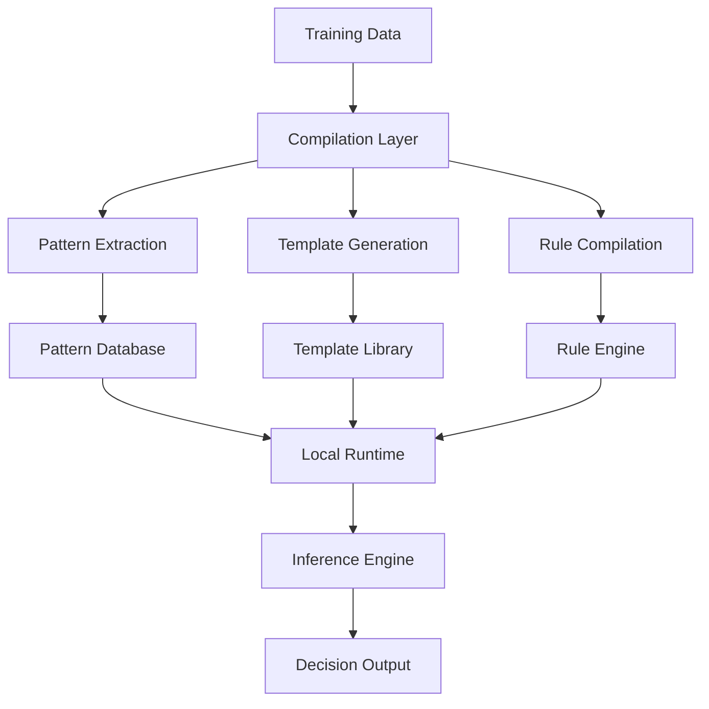
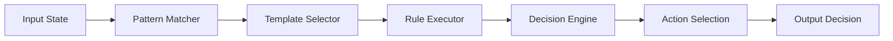

# Local Logic Models AI Training System
## Game Theory Optimization & Compilation-Based Learning Framework

A revolutionary approach to AI training that bridges the gap between traditional machine learning and local model optimization. This system introduces **Local Logic Models (LLMs)**, a novel compilation-based learning paradigm that transforms complex poker strategies into efficient, locally-executable models.

Rather than relying on conventional epoch-based training, our system employs a sophisticated compilation process that:

- Extracts strategic patterns from poker gameplay
- Compiles decision-making logic into optimized templates
- Generates runtime-efficient **Local Logic Models**
- Enables continuous strategy refinement without direct model updates

### What are Local Logic Models?

**Local Logic Models** are a new paradigm in AI that focuses on compiling domain-specific logic and patterns into highly optimized, localized models. Unlike traditional AI models that rely on vast amounts of data and extensive training epochs, LLMs compile strategic logic directly from data into executable models that can operate efficiently in local environments with minimal computational overhead.

Key characteristics of LLMs:

- **Localized Decision Making**: Efficient operation within specific domains or contexts.
- **Logic Compilation**: Transformation of strategic patterns and rules into executable logic.
- **Computational Efficiency**: Rapid inference with minimal resource usage.
- **Adaptability**: Easy updates with new logic without retraining large models.

### Key Features

1. **Pattern-Based Compilation**
   - Transforms explicit poker knowledge into implicit decision rules
   - Converts GTO principles into executable templates
   - Optimizes for local execution and rapid inference

2. **Strategy Transformation Pipeline**
   - Analyzes successful poker patterns
   - Compiles position-based strategies
   - Generates stack-aware decision templates
   - Creates reusable strategic components

3. **Local Logic Model Optimization**
   - Minimizes computational overhead
   - Reduces memory footprint
   - Enables rapid decision making
   - Supports continuous refinement

## 📊 System Architecture



**Key Components:**

- **Pattern Extraction Engine**
- **Strategy Compilation Layer**
- **Local Logic Model Optimization**
- **Runtime Decision System**

## 🎯 System Overview

The Poker AI Training System revolutionizes training through:

- Compilation of poker patterns into **Local Logic Models**
- Real-time strategy optimization
- Adaptive learning through pattern recognition
- Template-based decision making
- Position and stack-aware compilation

## 🎯 Features

### Core Capabilities

- **Advanced Decision Making Engine**
  - Real-time hand strength evaluation using Treys library
  - Position-based strategy optimization with DSPy
  - Dynamic opponent modeling through machine learning
  - Stack-size aware decisions with ICM considerations
  - Pot odds and implied odds calculations in real-time
  - Multi-street planning and hand reading
  - Range-based decision making

### Training Framework

- **Multi-Modal Learning System**
  - Supervised learning from expert gameplay
  - Reinforcement learning through self-play
  - Adversarial training against varied opponents
  - Real-time adaptation to opponent tendencies

### Analysis Tools

- **Performance Metrics**
  - Win rate tracking
  - Expected Value (EV) calculations
  - Decision quality assessment
  - Bluff efficiency analysis
  - Position-based performance metrics

### Customization Options

- **Training Parameters**
  - Learning rate adjustment
  - Batch size optimization
  - Temperature scaling
  - Early stopping criteria
  - Validation intervals

## 📈 Training Process



The system transforms poker knowledge through:

- **Pattern extraction** from game states
- **Strategy template compilation**
- **Local Logic Model optimization**
- **Runtime decision making**
- **Continuous refinement loop**

## Local Logic Model Approach: Compilation-Based Training

Our system introduces a paradigm shift in AI training through a compilation-based approach that transforms traditional epoch-based learning into **Local Logic Models**.



### How It Works

1. **Pattern Extraction Phase**
   - Analyzes training examples to identify successful decision patterns
   - Creates a structured pattern database for runtime reference
   - Maintains pattern hierarchies for different game scenarios

2. **Template Compilation**
   - Converts identified patterns into optimized decision templates
   - Generates position-specific strategy blueprints
   - Creates stack-depth aware decision frameworks
   - Builds reusable strategic components

3. **Rule Generation**
   - Compiles extracted patterns into executable decision rules
   - Optimizes rules for local execution
   - Creates efficient lookup and matching systems
   - Enables rapid runtime decision making

4. **Local Runtime System**
   - Executes compiled rules without requiring the full AI model
   - Uses pattern matching for rapid decision making
   - Maintains strategy consistency through template adherence
   - Enables efficient local execution on consumer hardware

### Key Benefits

1. **Computational Efficiency**
   - Eliminates the need for large model parameter updates
   - Reduces memory requirements significantly
   - Enables faster training iterations
   - Supports deployment on limited hardware

2. **Strategic Consistency**
   - Maintains GTO principles through compiled rules
   - Ensures consistent decision making
   - Reduces variance in strategic execution
   - Enables reliable pattern matching

3. **Adaptability**
   - Updates patterns without full model retraining
   - Incorporates new strategies through template additions
   - Allows rapid strategy adjustments
   - Supports continuous improvement

### Implementation Details



The **Local Logic Model** operates through:

- **Pattern matching** against the compiled database
- **Template selection** based on game state
- **Rule execution** for decision making
- **Rapid inference** without full model loading
- **Continuous pattern updates** and refinement

## 🛠 Advanced Customization

### Custom Hand Evaluator

```python
from poker_bot.hand_evaluator import HandEvaluator

class MyHandEvaluator(HandEvaluator):
    def calculate_hand_strength(self, cards):
        # Custom strength calculation
        strength = super().calculate_hand_strength(cards)
        # Add position-based adjustments
        return strength * self.position_multiplier()
```

### Custom Opponent Model

```python
from poker_bot.opponent_model import OpponentModel

class MyOpponentModel(OpponentModel):
    def analyze_opponent(self, history):
        tendencies = {
            'aggression': self.calculate_aggression(history),
            'bluff_frequency': self.detect_bluffs(history),
            'position_plays': self.analyze_position_play(history)
        }
        return self.generate_counter_strategy(tendencies)
```

## 🚀 Deployment

### Model Export

```python
# Export trained Local Logic Model
trainer.export_model('my_poker_model.llm')
```

### API Integration

```python
from poker_bot import PokerAPI

api = PokerAPI(model_path='my_poker_model.llm')
api.start(port=8000)
```

### Docker Deployment

```bash
# Build container
docker build -t poker-bot .

# Run API server
docker run -p 8000:8000 poker-bot
```

## 🚀 Quick Start

### Installation

```bash
# Clone the repository
git clone https://github.com/yourusername/poker-ai-trainer.git

# Navigate to project directory
cd poker-ai-trainer

# Install dependencies
./poker/start.sh
```

### Basic Usage

```bash
# Start training session
train

# Run hyperparameter tuning
tune

# Load specific checkpoint
load-checkpoint

# View training history
training-history
```

## 🎓 Training Tutorial

### 1. Understanding the Architecture

The system uses a multi-layered approach to poker decision making:

```python
class PokerAgent(dspy.Module):
    def __init__(self):
        self.hand_evaluator = HandEvaluator()
        self.opponent_model = OpponentModel()
        self.position_strategy = PositionStrategy()
```

### 2. Configuring Training Parameters

Optimize your training with custom configurations:

```python
config = TrainingConfig(
    num_epochs=1000,
    batch_size=32,
    learning_rate=0.001,
    validation_interval=50,
    patience=10,
    temperature=0.7
)
```

### 3. Data Generation & Augmentation

Create diverse training scenarios:

```python
def prepare_training_data():
    # Generate balanced hand distributions
    # Create multi-street scenarios
    # Vary stack sizes and positions
    return train_data, valid_data
```

## 🛠 Advanced Customization

### Game Theory Integration

- Implement Nash Equilibrium solvers
- Add range-based decision making
- Incorporate ICM modeling for tournaments

### Custom Evaluation Metrics

```python
class CustomEvaluator(PokerEvaluator):
    def __init__(self):
        self.metrics.extend([
            "fold_equity",
            "range_advantage",
            "stack_leverage"
        ])
```

### Opponent Modeling

```python
class OpponentModel:
    def analyze_opponent(self, history):
        # Pattern recognition
        # Tendency analysis
        # Exploit identification
```

## 📊 Performance Optimization

### 1. Hyperparameter Tuning

```python
param_grid = {
    'learning_rate': [0.001, 0.01, 0.1],
    'batch_size': [16, 32, 64],
    'temperature': [0.5, 0.7, 0.9]
}
```

### 2. Model Architecture Optimization

- Layer configuration
- Attention mechanisms
- Residual connections

### 3. Training Efficiency

- Batch processing
- GPU acceleration
- Distributed training

## 🔍 Monitoring & Analysis

### Training Metrics

- Loss curves
- Accuracy trends
- Validation performance
- Overfitting detection

### Performance Analysis

```python
class PerformanceAnalyzer:
    def analyze_session(self):
        # Win rate by position
        # Action distribution
        # EV analysis
        # Bluff success rate
```

## 🎮 Demo Mode

Practice and validate strategies:

```python
demo = DemoMode()
demo.simulate_game(
    opponent_level='expert',
    num_hands=100
)
```

## 🔧 Troubleshooting

Common issues and solutions:

- Training convergence problems
- Overfitting symptoms
- Memory optimization
- Performance bottlenecks

## 📚 Additional Resources

- [Poker Game Theory Fundamentals](link)
- [Advanced Training Techniques](link)
- [DSPy Documentation](link)
- [Community Forums](link)

## 🗺 Roadmap

### Upcoming Features

- Multi-table tournament support
- Real-time opponent modeling
- Advanced ICM calculations
- Hand range visualization
- Integration with popular poker platforms

### In Development

- Mobile client application
- Cloud training infrastructure
- Collaborative training framework

## 🤝 Contributing

### Issue Reporting

- Use the issue template
- Include hand histories when relevant
- Provide system information

### Pull Request Guidelines

- Follow PEP 8 style guide
- Include unit tests
- Update documentation
- Add to CHANGELOG.md

### Code Style

- Use type hints
- Document complex algorithms
- Follow project structure
- Include docstrings

## 📄 License

This project is licensed under the MIT License - see the [LICENSE](LICENSE) file for details.

## 🌟 Acknowledgments

- DSPy team for the core framework
- Poker theory contributors
- Community feedback and testing

---

For detailed documentation, visit our [Wiki](wiki-link).

For support, join our [Discord Community](discord-link).