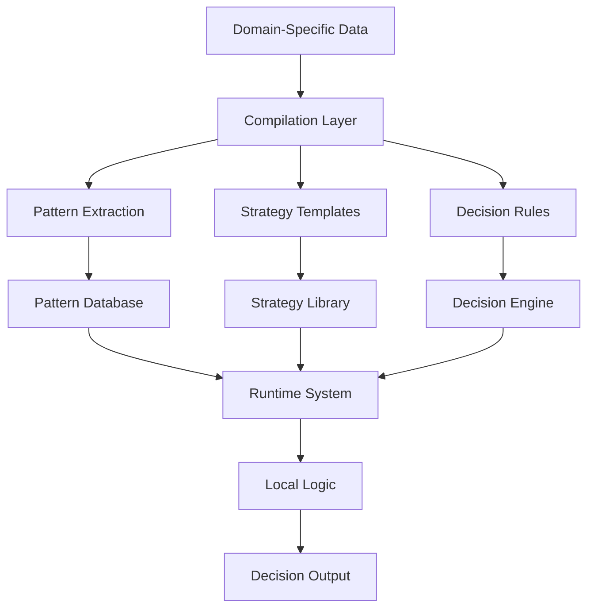
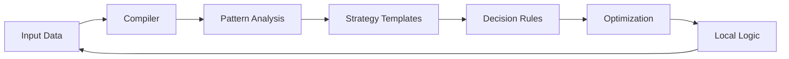
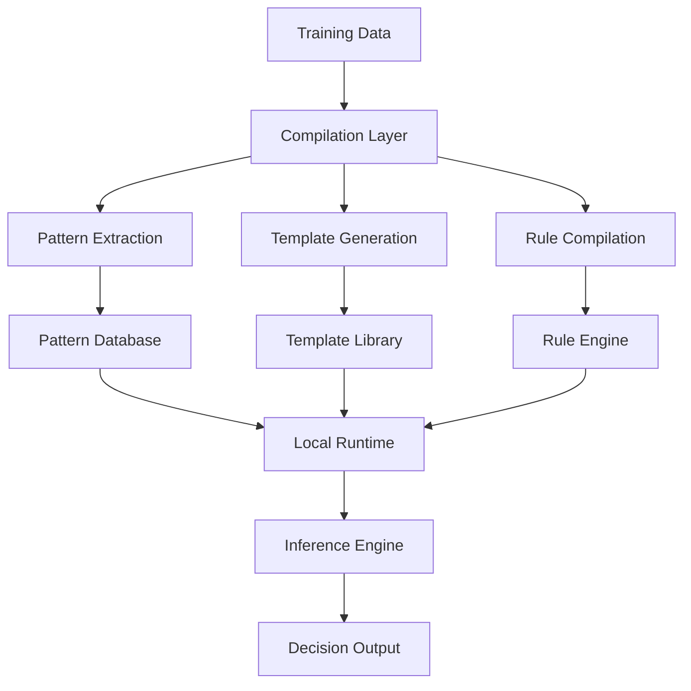

# Local Logic AI Training System

## Game Theory Optimization & Compilation-Based Learning Framework

*Created by rUv, because he could.*

Local Logic is an AI training system that bridges the gap between traditional machine learning and local model optimization. This system introduces **Local Logic**, a compilation-based learning paradigm that transforms complex strategies into efficient, locally-executable models across various domains such as finance, medicine, analytics, behavioral systems, DNA/genomic analysis, security, DevOps, project management, reasoning systems, and advanced agentic systems.

Rather than relying on conventional epoch-based training, our system employs a sophisticated compilation process that:

- Extracts strategic patterns from domain-specific data
- Compiles decision-making logic into optimized templates
- Generates runtime-efficient **Local Logic**
- Enables continuous strategy refinement without direct model updates

### What Is Local Logic?

**Local Logic** is a novel approach in AI that focuses on compiling domain-specific logic and patterns into highly optimized, localized models. Unlike traditional AI models that rely on vast amounts of data and extensive training epochs, Local Logic compiles strategic logic directly from data into executable models that operate efficiently in local environments with minimal computational overhead.

**Key Characteristics of Local Logic:**

- **Localized Decision Making**: Efficient operation within specific domains or contexts.
- **Logic Compilation**: Transformation of strategic patterns and rules into executable logic.
- **Computational Efficiency**: Rapid inference with minimal resource usage.
- **Adaptability**: Easy updates with new logic without retraining large models.

### Key Features

1. **Pattern-Based Compilation**
   - Transforms explicit domain knowledge into implicit decision rules
   - Converts complex principles into executable templates
   - Optimizes for local execution and rapid inference

2. **Strategy Transformation Pipeline**
   - Analyzes successful patterns across various domains
   - Compiles context-based strategies
   - Generates scenario-aware decision templates
   - Creates reusable strategic components

3. **Local Logic Optimization**
   - Minimizes computational overhead
   - Reduces memory footprint
   - Enables rapid decision making
   - Supports continuous refinement

## 📊 System Architecture

**Key Components:**

- **Pattern Extraction Engine**
- **Strategy Compilation Layer**
- **Local Logic Optimization**
- **Runtime Decision System**

## 🎯 System Overview

The Local Logic AI Training System enhances training through:

- Compilation of domain-specific patterns into **Local Logic**
- Real-time strategy optimization
- Adaptive learning through pattern recognition
- Template-based decision making
- Context and scenario-aware compilation

### Application Domains

While poker serves as an illustrative example, the system's versatility extends to various domains:

- **Finance**: Compiling trading strategies, risk assessment, and market prediction models
- **Medicine**: Transforming diagnostic patterns into decision support systems
- **Analytics**: Optimizing data interpretation and predictive analytics
- **Behavioral Systems**: Modeling human behavior patterns for enhanced interaction
- **DNA/Genomic Analysis**: Compiling genetic patterns for disease prediction and research
- **Security**: Developing threat detection and response models
- **DevOps**: Automating deployment strategies and system optimizations
- **Project Management**: Enhancing decision-making in resource allocation and scheduling
- **Reasoning Systems**: Compiling logic for problem-solving and decision support
- **Advanced Agentic Systems**: Creating autonomous agents with domain-specific expertise

## 🎯 Features

### Core Capabilities

- **Advanced Decision Making Engine**
  - Real-time evaluation of domain-specific scenarios
  - Context-based strategy optimization
  - Dynamic modeling through adaptive learning
  - Scenario-aware decisions with specific considerations
  - Rapid calculations and assessments in real-time
  - Multi-layered planning and analysis
  - Range-based decision making

### Training Framework

- **Multi-Modal Learning System**
  - Supervised learning from expert data
  - Reinforcement learning through simulation
  - Adversarial training against varied models
  - Real-time adaptation to new patterns

### Analysis Tools

- **Performance Metrics**
  - Success rate tracking
  - Expected Outcome (EO) calculations
  - Decision quality assessment
  - Efficiency analysis
  - Context-based performance metrics

### Customization Options

- **Training Parameters**
  - Learning rate adjustment
  - Batch size optimization
  - Early stopping criteria
  - Validation intervals

## 📈 Training Process

The system transforms domain knowledge through:

- **Pattern extraction** from input data
- **Strategy template compilation**
- **Local Logic optimization**
- **Runtime decision making**
- **Continuous refinement loop**

## Local Logic Approach: Compilation-Based Training

Our system uses a compilation-based approach that transforms traditional epoch-based learning into **Local Logic**.

### How It Works

1. **Pattern Extraction Phase**
   - Analyzes training data to identify successful patterns
   - Creates a structured pattern database for runtime reference
   - Maintains pattern hierarchies for different scenarios

2. **Template Compilation**
   - Converts identified patterns into optimized decision templates
   - Generates context-specific strategy blueprints
   - Creates scenario-aware decision frameworks
   - Builds reusable strategic components

3. **Rule Generation**
   - Compiles extracted patterns into executable decision rules
   - Optimizes rules for local execution
   - Creates efficient lookup and matching systems
   - Enables rapid runtime decision making

4. **Local Runtime System**
   - Executes compiled rules without requiring the full AI model
   - Uses pattern matching for rapid decision making
   - Maintains strategy consistency through template adherence
   - Enables efficient local execution on consumer hardware

### Key Benefits

1. **Computational Efficiency**
   - Eliminates the need for large model parameter updates
   - Reduces memory requirements significantly
   - Enables faster training iterations
   - Supports deployment on limited hardware

2. **Strategic Consistency**
   - Maintains domain principles through compiled rules
   - Ensures consistent decision making
   - Reduces variance in strategic execution
   - Enables reliable pattern matching

3. **Adaptability**
   - Updates patterns without full model retraining
   - Incorporates new strategies through template additions
   - Allows rapid strategy adjustments
   - Supports continuous improvement

## 🛠 Advanced Customization

### Domain-Specific Integration

- Implement industry-specific algorithms and models
- Add range-based decision making tailored to the domain
- Incorporate specialized considerations (e.g., regulatory compliance in finance, ethical guidelines in medicine)

### Custom Evaluation Metrics

- Define metrics that reflect success and efficiency within the specific domain
- Extend performance analysis to include domain-specific KPIs

### Adaptive Modeling

- Analyze patterns and tendencies unique to the domain
- Identify opportunities for optimization and improvement
- Develop strategies to address domain-specific challenges

## 📊 Performance Optimization

### 1. Hyperparameter Tuning

- Adjust learning rates, batch sizes, and other parameters to optimize performance within the domain

### 2. Model Architecture Optimization

- Configure layers and components specific to the domain
- Utilize appropriate mechanisms (e.g., attention models, recurrent structures)

### 3. Training Efficiency

- Employ batch processing and acceleration techniques
- Utilize distributed training where applicable

## 🔍 Monitoring & Analysis

### Training Metrics

- Monitor loss curves, accuracy trends, and validation performance
- Detect overfitting or underfitting early in the training process

### Performance Analysis

- Analyze performance across different scenarios and contexts within the domain
- Evaluate decision quality and efficiency

## 🎯 Evaluating Local Logic

Evaluating the effectiveness of **Local Logic** involves several key methodologies to ensure that the compiled logic meets the desired performance and accuracy standards within its specific domain.

### Evaluation Criteria

1. **Accuracy and Precision**
   - Measure how correctly the Local Logic makes decisions compared to expert benchmarks.
   - Use domain-specific datasets to validate decision outputs.

2. **Efficiency Metrics**
   - Assess the computational resources required for inference.
   - Monitor memory usage and processing time during runtime.

3. **Consistency and Reliability**
   - Ensure that decisions are consistent across similar scenarios.
   - Test the Local Logic under varying conditions to evaluate stability.

4. **Adaptability Testing**
   - Evaluate how easily the Local Logic can incorporate new patterns or strategies.
   - Test updates and refinements without retraining the entire system.

5. **Performance Benchmarks**
   - Compare Local Logic performance against traditional AI models in the same domain.
   - Use standardized benchmarks relevant to each application area.

### Evaluation Process

1. **Data Collection**
   - Gather comprehensive datasets that represent various scenarios within the target domain.
   - Include both historical and real-time data to simulate different conditions.

2. **Simulation and Testing**
   - Run simulations to test how Local Logic handles different decision-making scenarios.
   - Use stress testing to evaluate performance under high-load conditions.

3. **Comparative Analysis**
   - Compare Local Logic outputs with those from existing models or expert decisions.
   - Identify areas where Local Logic outperforms or underperforms.

4. **Feedback Loop**
   - Incorporate feedback from domain experts to refine decision rules.
   - Continuously update the pattern database based on evaluation outcomes.

5. **Iterative Refinement**
   - Use evaluation results to iteratively improve the Local Logic templates and rules.
   - Ensure ongoing optimization aligns with evolving domain requirements.

## 🎮 Example Application: Poker

As an illustrative example, in the poker domain, Local Logic would:

- **Analyze Historical Hand Data**: Extract winning patterns and strategic insights from past games.
- **Compile Strategies**: Develop strategies based on factors such as position, stack size, and opponent behavior.
- **Generate Decision Rules**: Create rules for real-time gameplay decisions, such as when to bet, fold, or raise.
- **Enable Rapid Decision-Making**: Ensure quick and efficient decision-making with minimal computational resources, allowing for seamless integration into live or online poker platforms.

## 🔧 Troubleshooting

Common issues and solutions:

- **Training Convergence Problems**: Adjust learning rates or revisit data preprocessing steps.
- **Overfitting Symptoms**: Implement regularization techniques or increase validation data.
- **Memory Optimization**: Optimize data loading and model components to reduce memory usage.
- **Performance Bottlenecks**: Profile the system to identify and address slow components.

## 📚 Additional Resources

- **Finance Applications**: [Algorithmic Trading Strategies](link)
- **Medical Decision Support**: [Clinical Decision Systems](link)
- **Data Analytics**: [Advanced Data Interpretation Techniques](link)
- **Behavioral Modeling**: [Human-Computer Interaction Patterns](link)
- **DNA/Genomic Analysis**: [Genomic Data Processing](link)

## 🗺 Roadmap

### Upcoming Features

- Enhanced support for multi-domain integration
- Real-time adaptive learning capabilities
- Advanced visualization tools for strategy analysis
- Integration with popular platforms and tools across various industries

### In Development

- Mobile and edge computing support for Local Logic
- Cloud-based training and deployment infrastructure
- Collaborative framework for multi-user development and training

## 🤝 Contributing

### Issue Reporting

- Use the issue template specific to the domain
- Include detailed descriptions and relevant data samples
- Provide system and environment information

### Contribution Guidelines

- Follow established coding and documentation standards
- Include tests and validation for new features
- Update relevant documentation and changelogs

### Code Style

- Maintain readability and consistency
- Document algorithms and decision logic thoroughly
- Adhere to project structure and best practices

## 📄 License

This project is licensed under the MIT License - see the [LICENSE](LICENSE) file for details.

## 🌟 Acknowledgments

- To **rUv** for the creation and vision behind Local Logic
- Contributors and collaborators across various domains
- Community feedback and support that drives continuous improvement

---

For detailed documentation, visit our [Wiki](wiki-link).

For support, join our [Community Forum](forum-link).