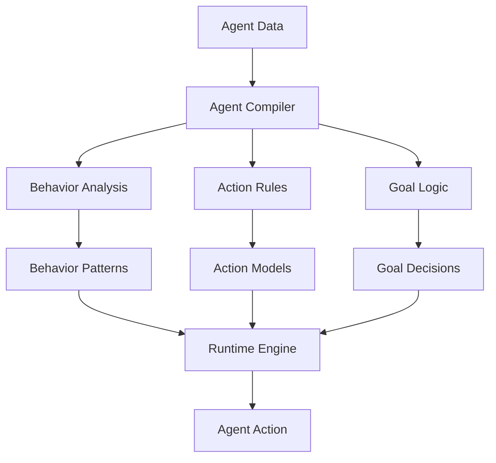

# Agentic System Compilation

## Overview
Implementation of Local Logic for autonomous agent systems, demonstrating the system's ability to compile complex agent behaviors into efficient local models.

## Implementation Details

### Pattern Analysis
- Agent behavior modeling
- Goal-oriented planning
- Action sequence optimization
- Environment interaction

### Agent Compilation
- Behavior strategies
- Action templates
- Goal models
- Performance optimization

### Runtime Operation
- Real-time decision making
- Quick action selection
- Dynamic goal adjustment
- Rapid environment response

## Key Benefits
1. **Efficient Processing**
   - Quick decision execution
   - Rapid action selection
   - Low latency operation

2. **Agent Depth**
   - Complex behaviors in simple rules
   - Goal-aware actions
   - Performance-optimized decisions

3. **Adaptability**
   - Pattern updates
   - New behavior integration
   - Quick strategy adjustments
