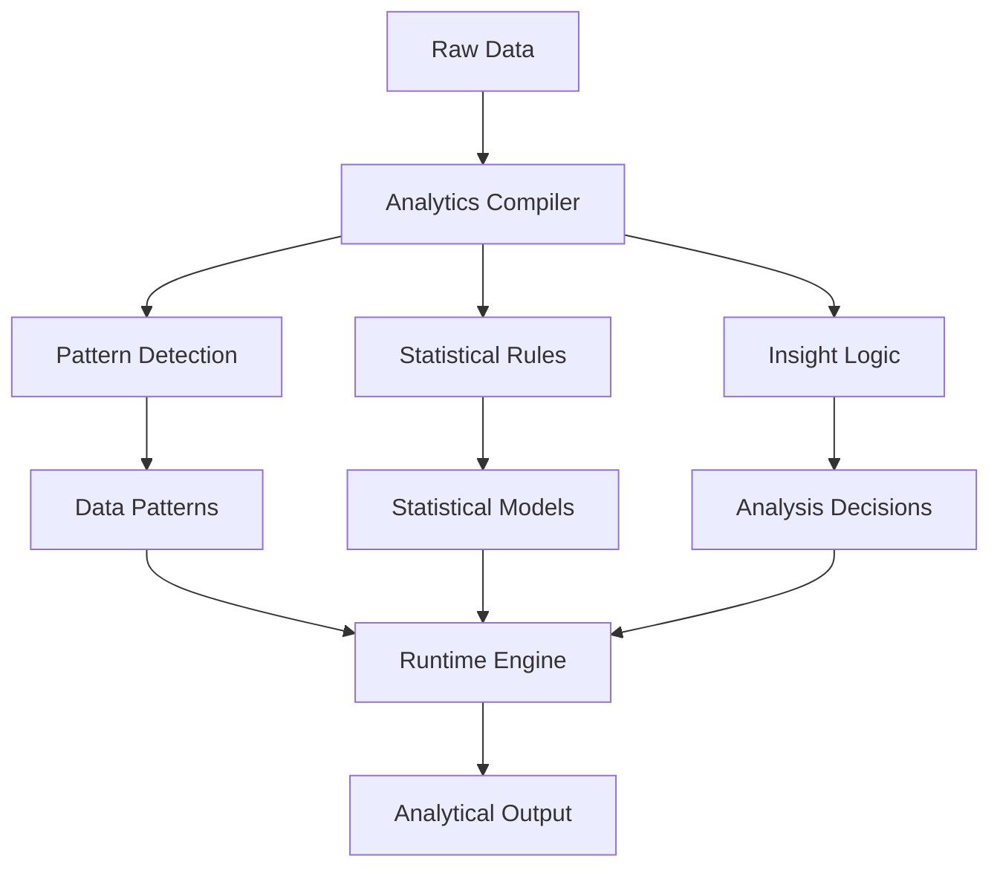

# Data Analytics Compilation System

## Overview
Implementation of Local Logic for data interpretation and analysis, demonstrating the system's ability to compile complex analytical patterns into efficient local models.

## Implementation Details

### Pattern Detection
- Data trend analysis
- Anomaly identification
- Correlation patterns
- Feature importance

### Analytics Compilation
- Statistical models
- Insight generation rules
- Analysis templates
- Output optimization

### Runtime Analysis
- Real-time data processing
- Quick insight generation
- Dynamic pattern matching
- Rapid result delivery

## Key Benefits
1. **Efficient Processing**
   - Fast data analysis
   - Quick insight generation
   - Minimal resource usage

2. **Analytical Depth**
   - Complex patterns in simple rules
   - Data-aware processing
   - Insight-optimized analysis

3. **Adaptability**
   - Pattern updates
   - New model integration
   - Quick analytical adjustments
