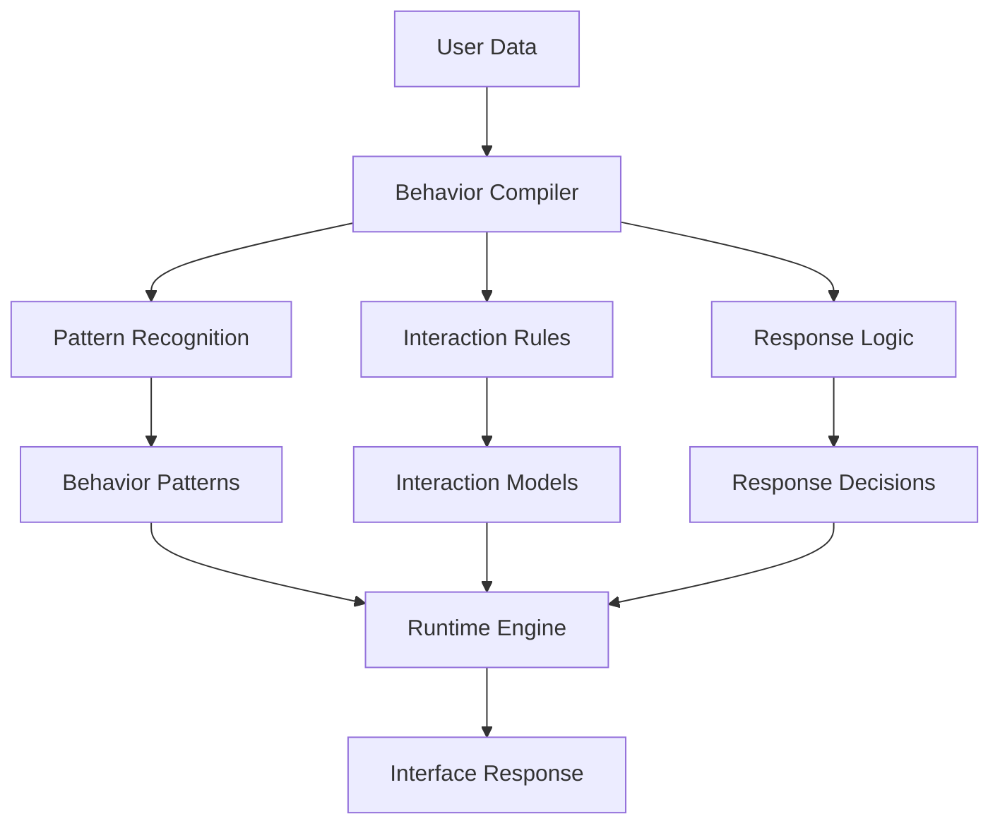

# Behavioral Pattern Compilation System

## Overview
Implementation of Local Logic for human-computer interaction, demonstrating the system's ability to compile complex behavioral patterns into efficient local models.

## Implementation Details

### Pattern Recognition
- User behavior analysis
- Interaction patterns
- Preference modeling
- Response optimization

### Interaction Compilation
- Interface guidelines
- Response templates
- Behavior models
- Experience optimization

### Runtime Adaptation
- Real-time user analysis
- Quick interface adjustments
- Dynamic response generation
- Rapid adaptation

## Key Benefits
1. **Efficient Processing**
   - Quick response generation
   - Smooth interaction flow
   - Low latency operation

2. **Interaction Depth**
   - Complex behaviors in simple rules
   - User-aware responses
   - Experience-optimized design

3. **Adaptability**
   - Pattern updates
   - New behavior integration
   - Quick response adjustments
