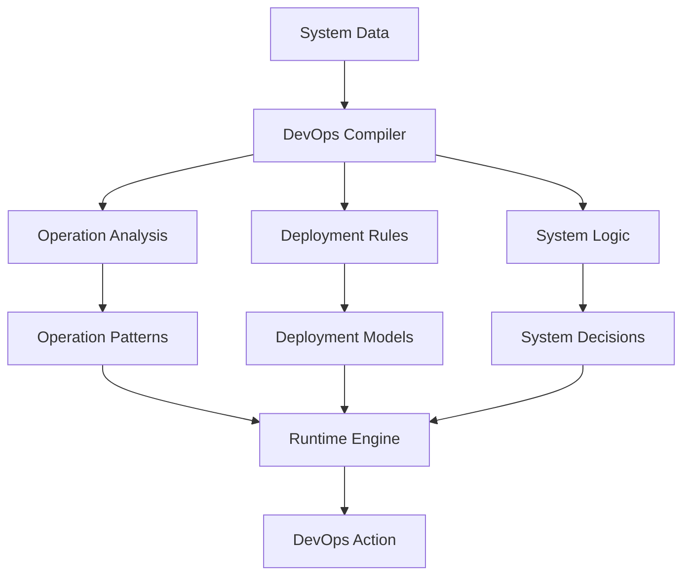

# DevOps Compilation System

## Overview
Implementation of Local Logic for deployment and operations, demonstrating the system's ability to compile complex DevOps patterns into efficient local models.

## Implementation Details

### Pattern Analysis
- System behavior monitoring
- Performance pattern detection
- Resource utilization analysis
- Deployment optimization

### DevOps Compilation
- Deployment strategies
- Operation templates
- System models
- Resource optimization

### Runtime Operations
- Real-time system monitoring
- Quick deployment adjustments
- Dynamic resource allocation
- Rapid incident response

## Key Benefits
1. **Efficient Processing**
   - Quick deployment execution
   - Rapid system adaptation
   - Low overhead monitoring

2. **Operational Depth**
   - Complex operations in simple rules
   - System-aware deployment
   - Resource-optimized management

3. **Adaptability**
   - Pattern updates
   - New strategy integration
   - Quick system adjustments
