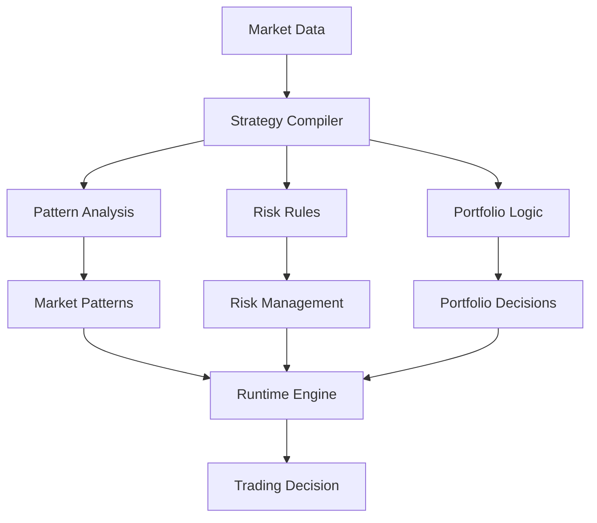

# Financial Strategy Compilation System

## Overview
Implementation of Local Logic for algorithmic trading and financial decision-making, demonstrating the system's ability to compile complex market analysis into efficient local models.

## Implementation Details

### Pattern Analysis
- Technical indicator compilation
- Market trend identification
- Volume profile analysis
- Price action patterns

### Strategy Compilation
- Risk management rules
- Position sizing logic
- Market condition templates
- Entry/exit optimization

### Runtime Decision Making
- Real-time market analysis
- Quick position adjustments
- Dynamic risk management
- Rapid market adaptation

## Key Benefits
1. **Efficient Processing**
   - Minimal latency in execution
   - Quick market response
   - Low resource utilization

2. **Strategic Depth**
   - Complex strategies in simple rules
   - Market-aware execution
   - Risk-optimized trading

3. **Adaptability**
   - Fast strategy updates
   - New pattern integration
   - Quick market adjustments
