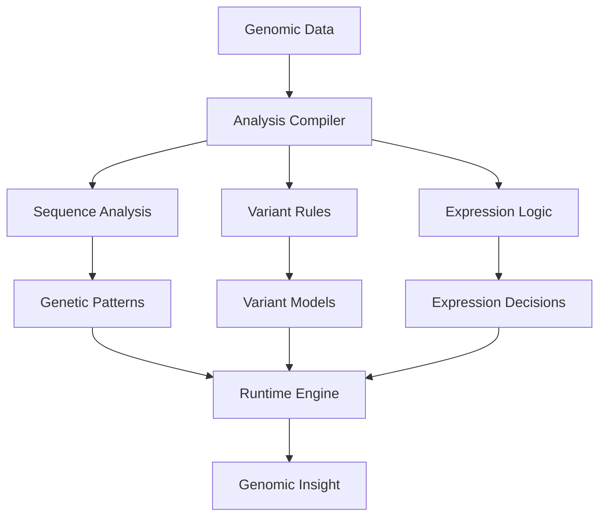

# Genomic Analysis Compilation System

## Overview
Implementation of Local Logic for genomic data processing, demonstrating the system's ability to compile complex genetic patterns into efficient local models.

## Implementation Details

### Pattern Analysis
- Sequence pattern detection
- Variant identification
- Expression analysis
- Pathway mapping

### Analysis Compilation
- Variant interpretation rules
- Expression templates
- Pathway models
- Result optimization

### Runtime Processing
- Real-time sequence analysis
- Quick variant assessment
- Dynamic expression analysis
- Rapid insight generation

## Key Benefits
1. **Efficient Processing**
   - Fast sequence analysis
   - Quick variant calling
   - Low computational overhead

2. **Analytical Depth**
   - Complex patterns in simple rules
   - Sequence-aware processing
   - Pathway-optimized analysis

3. **Adaptability**
   - Pattern updates
   - New variant integration
   - Quick analysis adjustments
