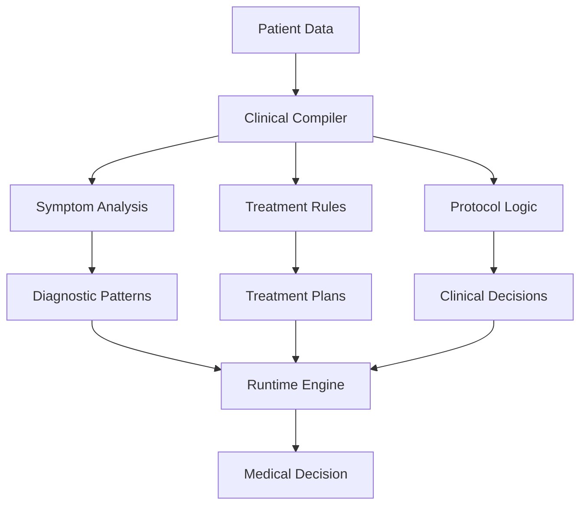

# Clinical Decision Support System

## Overview
Implementation of Local Logic for medical diagnosis and treatment planning, demonstrating the system's ability to compile complex clinical guidelines into efficient local models.

## Implementation Details

### Pattern Analysis
- Symptom correlation
- Disease progression patterns
- Treatment response analysis
- Risk factor identification

### Protocol Compilation
- Treatment guidelines
- Drug interaction rules
- Care pathway templates
- Outcome optimization

### Runtime Decision Making
- Real-time patient assessment
- Quick protocol adjustments
- Dynamic risk evaluation
- Rapid response adaptation

## Key Benefits
1. **Efficient Processing**
   - Quick diagnostic support
   - Rapid treatment planning
   - Low computational overhead

2. **Clinical Depth**
   - Evidence-based protocols
   - Patient-specific care
   - Risk-optimized treatment

3. **Adaptability**
   - Protocol updates
   - New guideline integration
   - Quick clinical adjustments
