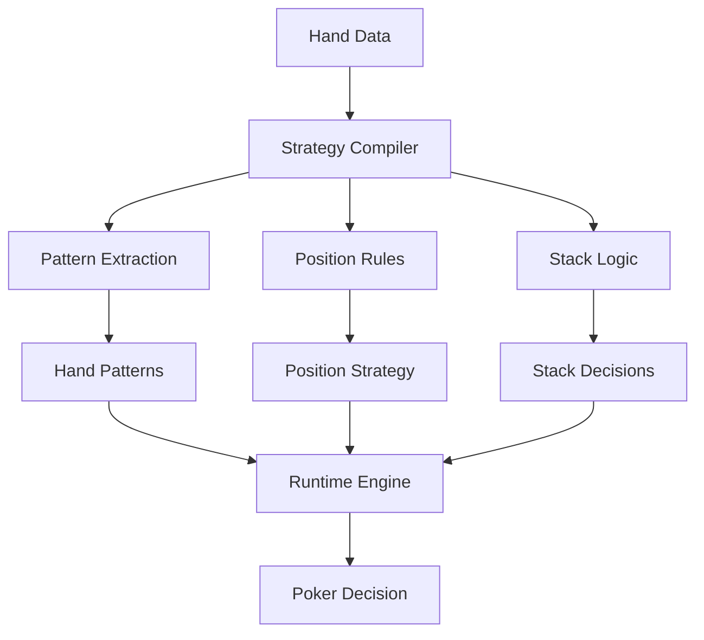

# Poker Strategy Compilation System

## Overview
Implementation of Local Logic for poker decision-making, demonstrating the system's ability to compile complex game theory into efficient local models.

## Implementation Details

### Pattern Extraction
- Historical hand analysis
- Winning pattern identification
- Player tendency modeling
- Board texture analysis

### Strategy Compilation
- Position-based strategy templates
- Stack-depth considerations
- Opponent modeling patterns
- Betting pattern optimization

### Runtime Decision Making
- Real-time hand evaluation
- Quick position adjustments
- Dynamic stack considerations
- Rapid opponent adaptation

## Key Benefits
1. **Efficient Processing**
   - Minimal computation during play
   - Quick decision making
   - Low memory footprint

2. **Strategic Depth**
   - Complex strategies in simple rules
   - Position-aware play
   - Stack-size optimization

3. **Adaptability**
   - Easy strategy updates
   - New pattern integration
   - Quick opponent adjustments
