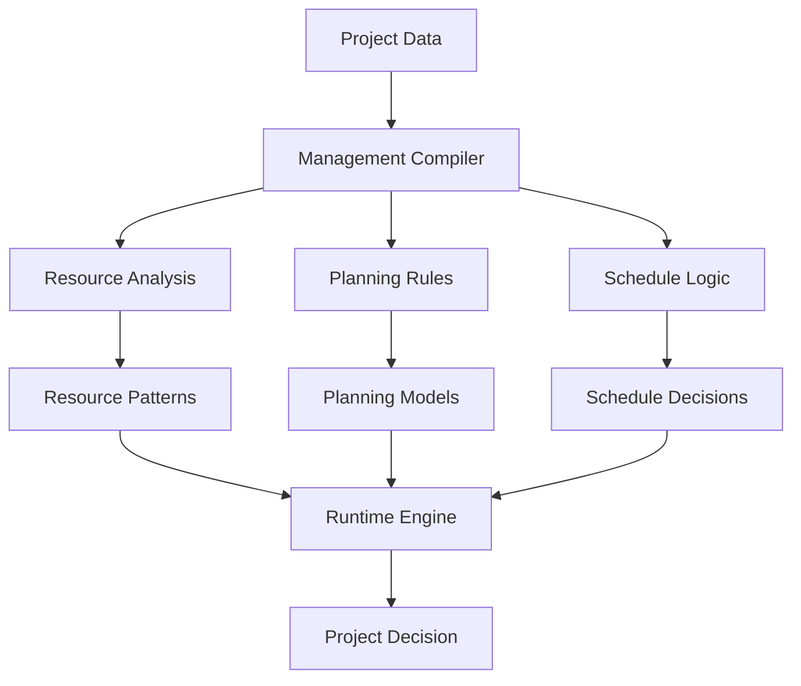

# Project Management Compilation System

## Overview
Implementation of Local Logic for project planning and resource management, demonstrating the system's ability to compile complex project patterns into efficient local models.

## Implementation Details

### Pattern Analysis
- Resource utilization patterns
- Project timeline analysis
- Team performance modeling
- Risk assessment

### Management Compilation
- Resource allocation rules
- Planning templates
- Schedule models
- Risk optimization

### Runtime Management
- Real-time resource tracking
- Quick schedule adjustments
- Dynamic team allocation
- Rapid risk response

## Key Benefits
1. **Efficient Processing**
   - Quick decision making
   - Rapid resource allocation
   - Low overhead planning

2. **Management Depth**
   - Complex projects in simple rules
   - Resource-aware planning
   - Schedule-optimized decisions

3. **Adaptability**
   - Pattern updates
   - New strategy integration
   - Quick plan adjustments
