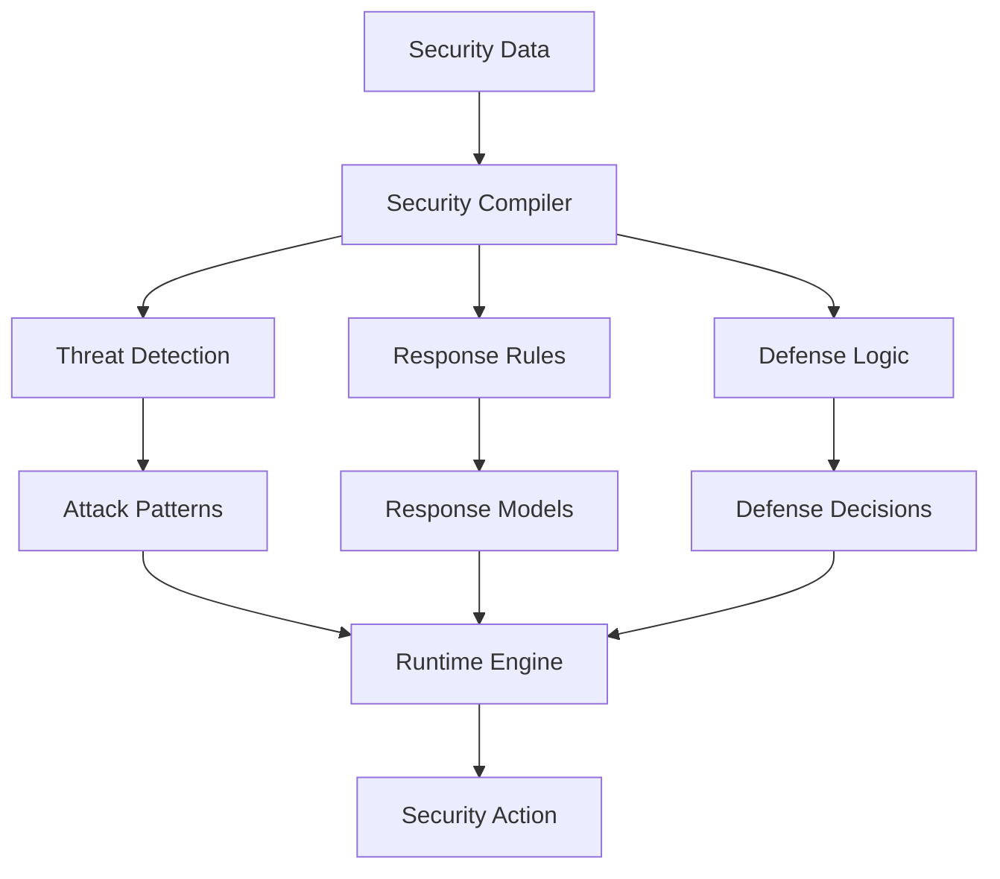

# Security Pattern Compilation System

## Overview
Implementation of Local Logic for security monitoring and threat response, demonstrating the system's ability to compile complex security patterns into efficient local models.

## Implementation Details

### Pattern Detection
- Threat pattern analysis
- Attack vector identification
- Vulnerability assessment
- Risk profiling

### Security Compilation
- Response protocols
- Defense templates
- Threat models
- Protection optimization

### Runtime Response
- Real-time threat detection
- Quick incident response
- Dynamic defense adjustment
- Rapid threat mitigation

## Key Benefits
1. **Efficient Processing**
   - Quick threat detection
   - Rapid response deployment
   - Low latency operation

2. **Security Depth**
   - Complex threats in simple rules
   - Context-aware protection
   - Risk-optimized defense

3. **Adaptability**
   - Pattern updates
   - New threat integration
   - Quick defense adjustments
