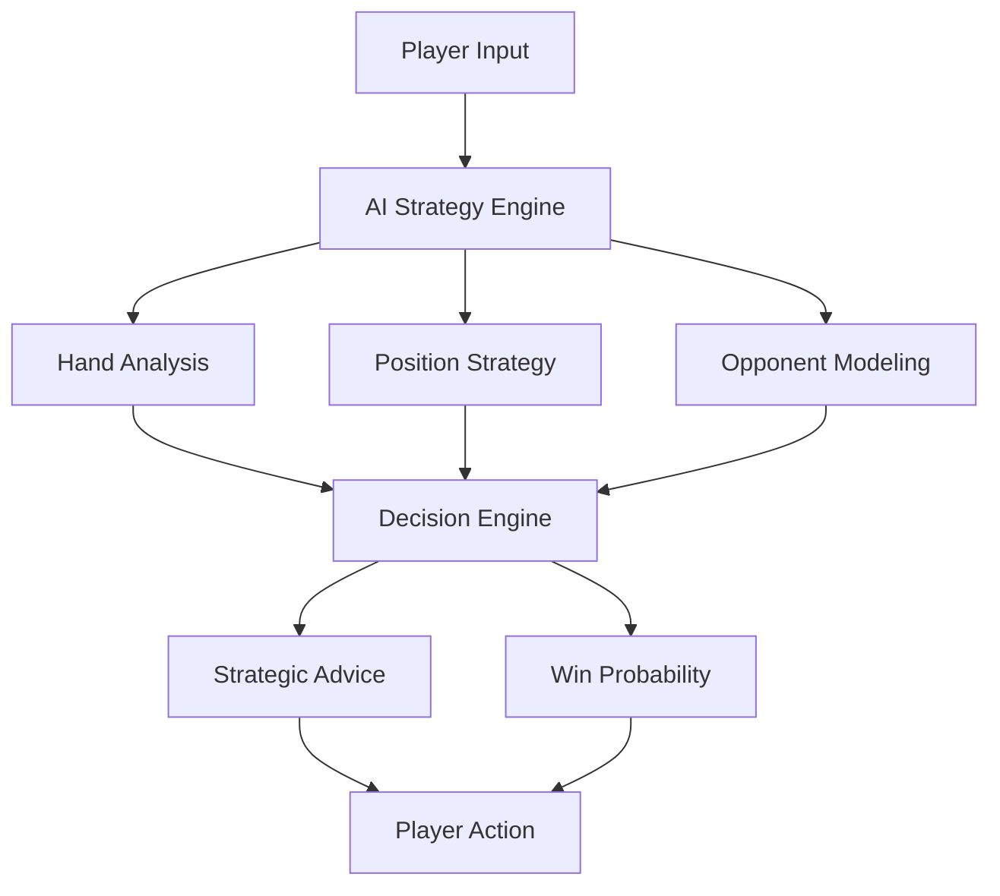
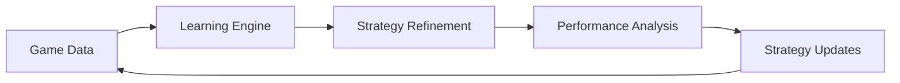
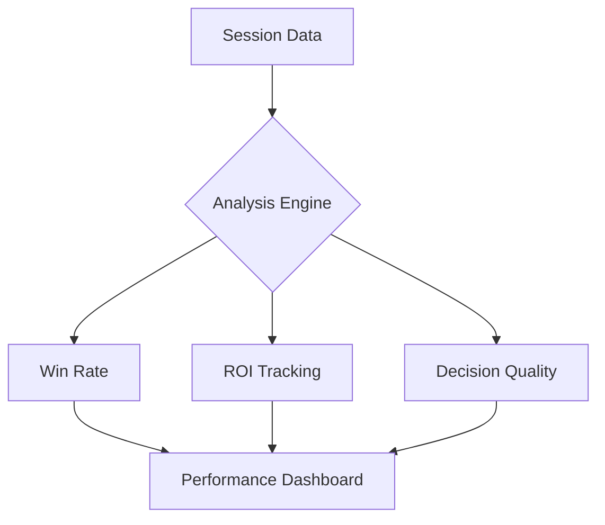
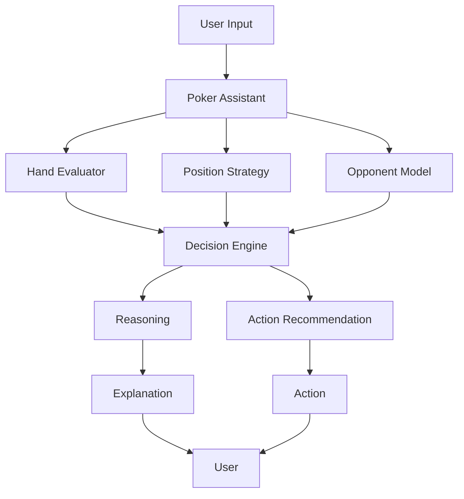
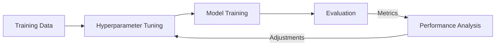
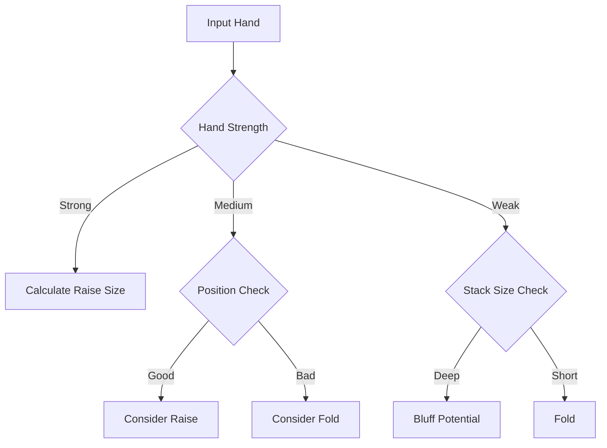
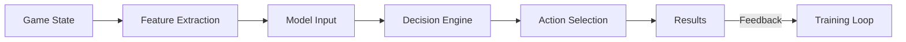
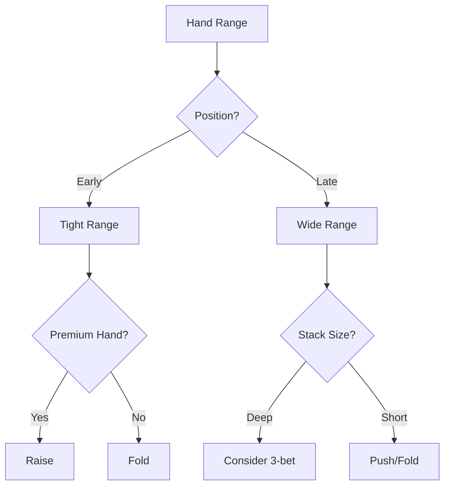
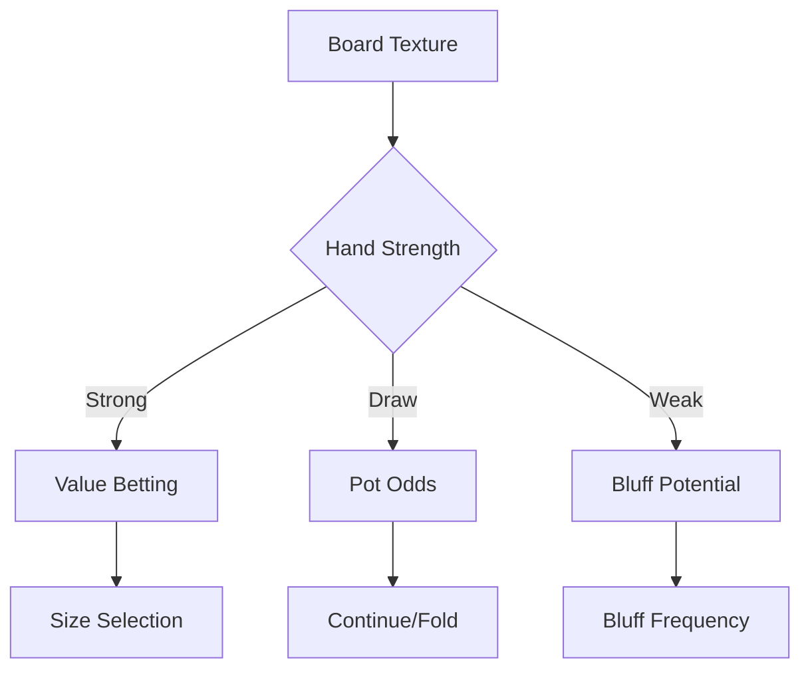

# Poker Bot - AI-Powered Poker Strategy Assistant

> Advanced poker decision support powered by GPT-4-mini and Monte Carlo simulations

## Overview

Transform your poker game with our AI-powered assistant that combines cutting-edge machine learning with proven poker strategy.



## Key Features

### 🎯 Real-Time Decision Support
- Advanced hand strength analysis
- Position-based strategy adjustments
- Stack size optimization
- Opponent tendency modeling

### 🧠 Continuous Learning
- Adapts to your playing style
- Learns from each session
- Improves through self-play
- Performance analytics



### 📊 Performance Tracking



## Why Choose Our Poker Bot?

- **Advanced AI Technology**: Powered by GPT-4-mini and Monte Carlo simulations
- **Proven Results**: Consistently profitable across different game formats
- **Easy Integration**: Simple setup, immediate results
- **Continuous Improvement**: Regular updates and strategy refinements

## Game Support

- Cash Games
- Tournaments
- Sit & Go's
- Various Stack Depths
- All Popular Variants

## Getting Started

### Quick Install
```bash
pip install poker-bot
```

### Basic Usage
```python
from poker_bot import PokerAssistant

assistant = PokerAssistant()
advice = assistant.get_action(
    hand="AH KH",
    position="BTN", 
    pot_size=100,
    stack_size=1000
)
print(advice)
```

### Prerequisites
- Python 3.8+
- GPU recommended for training
- 4GB+ RAM

## Community & Support

- [Discord Community](link-to-discord)
- [Support Portal](link-to-support)
- [Strategy Forum](link-to-forum)

## Success Stories

> "Improved my win rate by 15% in the first month" - Professional Player

> "Finally beating the microstakes consistently" - Recreational Player

## License

MIT License - See [LICENSE](LICENSE) for details

---

<div align="center">
<strong>Ready to transform your poker game?</strong><br>
<a href="link-to-docs">Get Started Now</a>
</div>
The poker bot is an advanced AI system designed to assist in poker decision-making and strategy development. Built on the DSPy framework and utilizing GPT-4-mini, it combines deep learning with Monte Carlo simulations to provide sophisticated poker analysis and recommendations.

## Key Features

### 1. Decision Support
- Real-time hand analysis
- Position-based strategy adjustments
- Stack-size considerations
- Opponent modeling and adaptation
- Bluff detection and recommendation

### 2. Learning System
- Continuous improvement through gameplay
- Adaptation to different playing styles
- Performance tracking and analysis
- Customizable training parameters
- [Detailed training documentation](training.md)

### 3. Evaluation System
- Comprehensive performance metrics
- Win rate tracking
- Expected value calculations
- Decision quality assessment
- [Complete evaluation metrics](evaluation.md)

### 4. Customization
- Adjustable playing style
- Tournament vs. Cash game optimization
- Stack size adaptation
- Position-based adjustments
- [Hyperparameter tuning guide](hyperparameters.md)

## User Guide

### Getting Started

1. **Installation**
```bash
pip install poker-bot
```

2. **Basic Usage**
```python
from poker_bot import PokerAssistant

assistant = PokerAssistant()
advice = assistant.get_action(
    hand="AH KH",
    position="BTN",
    pot_size=100,
    stack_size=1000
)
```

3. **Configuration**
```python
config = TrainingConfig(
    temperature=0.7,  # More creative play
    num_simulations=1000  # Higher accuracy
)
```

### Game Modes

#### 1. Cash Game Mode
- Optimized for deep-stack play
- Focus on long-term EV
- Adjustable risk parameters
```python
assistant.set_game_type('cash')
assistant.set_stack_depth('deep')  # 100BB+
```

#### 2. Tournament Mode
- ICM-aware decisions
- Stack preservation focus
- Bubble factor consideration
```python
assistant.set_game_type('tournament')
assistant.set_stage('bubble')  # Near money
```

### Strategy Customization

#### 1. Playing Style
```python
# Aggressive style
config = TrainingConfig(
    temperature=0.8,
    aggression_factor=1.2
)

# Conservative style
config = TrainingConfig(
    temperature=0.5,
    aggression_factor=0.8
)
```

#### 2. Position Adjustment
The bot automatically adjusts strategy based on position:
- BTN (Button): Most aggressive
- CO (Cutoff): Aggressive
- MP (Middle Position): Balanced
- UTG (Under the Gun): Conservative
- BB (Big Blind): Defense-oriented
- SB (Small Blind): Selective

#### 3. Stack Size Adaptation
```python
# Short stack mode (<30BB)
assistant.set_stack_mode('short')

# Deep stack mode (>100BB)
assistant.set_stack_mode('deep')
```

### Training & Improvement

#### 1. Basic Training
```python
trainer = PokerTrainer()
trainer.train()  # Uses default settings
```

#### 2. Advanced Training
```python
config = TrainingConfig(
    num_epochs=200,
    batch_size=32,
    learning_rate=0.001
)
trainer.train(config)
```

See [Training Documentation](training.md) for detailed options.

### Performance Analysis

#### 1. Basic Stats
```python
stats = assistant.get_performance_stats()
print(f"Win Rate: {stats['win_rate']:.2%}")
print(f"EV/100: {stats['ev_per_100']:.2f}")
```

#### 2. Detailed Analysis
```python
analysis = assistant.generate_analysis_report()
```

See [Evaluation Documentation](evaluation.md) for metrics details.

### Best Practices

#### 1. Regular Evaluation
- Monitor win rate trends
- Track decision quality
- Review bluff efficiency
- Analyze EV calculations

#### 2. Training Optimization
- Start with default parameters
- Gradually adjust based on results
- Use diverse training scenarios
- Regular performance reviews

#### 3. Game Selection
- Match bot configuration to game type
- Consider stack depths
- Adjust for opponent types
- Table position awareness

### Troubleshooting

#### 1. Performance Issues
- Check training data quality
- Verify configuration settings
- Review recent decisions
- Analyze opponent modeling

#### 2. Decision Quality
- Monitor win rate trends
- Check EV calculations
- Review position play
- Analyze bluff frequency

#### 3. Training Problems
- Verify data integrity
- Check parameter settings
- Monitor convergence
- Review error logs

## Advanced Topics

### 1. Custom Strategy Development
```python
strategy = CustomStrategy(
    preflop_ranges="custom_ranges.txt",
    postflop_adjustments=True
)
assistant.load_custom_strategy(strategy)
```

### 2. Opponent Modeling
```python
opponent_profile = assistant.create_opponent_profile(
    player_id="Player1",
    style="LAG",  # Loose-Aggressive
    tendencies={
        "3bet_frequency": 0.12,
        "fold_to_3bet": 0.45
    }
)
```

### 3. Tournament Specific
```python
icm_config = ICMConfig(
    tournament_stage="final_table",
    bubble_factor=1.5,
    stack_distribution=[10000, 8000, 5000, 3000]
)
assistant.set_tournament_config(icm_config)
```

## Additional Resources

- [Training System Details](training.md)
- [Evaluation Metrics Guide](evaluation.md)
- [Hyperparameter Optimization](hyperparameters.md)
- [API Reference](api_reference.md)

## Support

For additional support:
- GitHub Issues: [Report bugs or request features]
- Documentation: [Full documentation]
- Community: [Join our Discord]

## Updates and Maintenance

The bot receives regular updates for:
- Strategy improvements
- Bug fixes
- Performance optimizations
- New features

Keep your installation updated:
```bash
pip install --upgrade poker-bot
```

## Contributing

We welcome contributions! See our [Contributing Guide](CONTRIBUTING.md) for details on:
- Code style
- Testing requirements
- Pull request process
- Development setup
# Poker Bot Documentation

## System Architecture



## Training Flow



## Decision Process



## Data Flow



## Getting Started

### 1. Installation
```bash
pip install poker-bot
```

### 2. Basic Usage
```python
from poker_bot import PokerAgent

agent = PokerAgent()
action, reasoning = agent.get_decision(
    hand="AH KH",
    position="BTN",
    stack_size=1000
)
```

### 3. Training Setup
```python
from poker_bot import PokerTrainer
from poker_bot.config import TrainingConfig

config = TrainingConfig(
    num_epochs=100,
    batch_size=32,
    learning_rate=0.001
)

trainer = PokerTrainer()
trainer.train(config)
```

## Configuration Examples

### Tournament Mode
```python
config = TrainingConfig(
    temperature=0.4,  # More conservative
    num_simulations=2000,  # Higher accuracy
    patience=20  # Allow more convergence time
)
```

### Cash Game Mode
```python
config = TrainingConfig(
    temperature=0.7,  # More aggressive
    learning_rate=0.01,  # Faster adaptation
    batch_size=16  # Quick updates
)
```

## Decision Trees

### Preflop Decisions


### Postflop Decisions


## Troubleshooting Guide

### Common Issues

1. **Poor Performance**
   - Check training data quality
   - Verify hyperparameters
   - Monitor convergence
   - Review validation metrics

2. **Memory Issues**
   - Reduce batch size
   - Decrease simulation count
   - Optimize data loading
   - Clear cache regularly

3. **Unstable Training**
   - Lower learning rate
   - Increase batch size
   - Adjust temperature
   - Check data distribution

### Performance Optimization

1. **Speed**
   - Use batch processing
   - Enable GPU acceleration
   - Optimize simulation count
   - Cache frequent calculations

2. **Accuracy**
   - Increase training data
   - Fine-tune hyperparameters
   - Implement cross-validation
   - Monitor overfitting

3. **Memory**
   - Stream large datasets
   - Clear unused objects
   - Profile memory usage
   - Optimize data structures

## Additional Resources

- [Hyperparameter Documentation](hyperparameters.md)
- [Training Guide](training.md)
- [Evaluation Methods](evaluation.md)
- [API Reference](api_reference.md)

## Version History

### v1.0.0 (2024-01)
- Initial release
- Basic poker decision support
- Training system implementation
- Evaluation metrics

### v0.9.0 (2023-12)
- Beta release
- Core functionality complete
- Documentation added

## Contributing

Please read our [Contributing Guidelines](CONTRIBUTING.md) for details on our code of conduct and the process for submitting pull requests.

## License

This project is licensed under the MIT License - see the [LICENSE](LICENSE) file for details.
