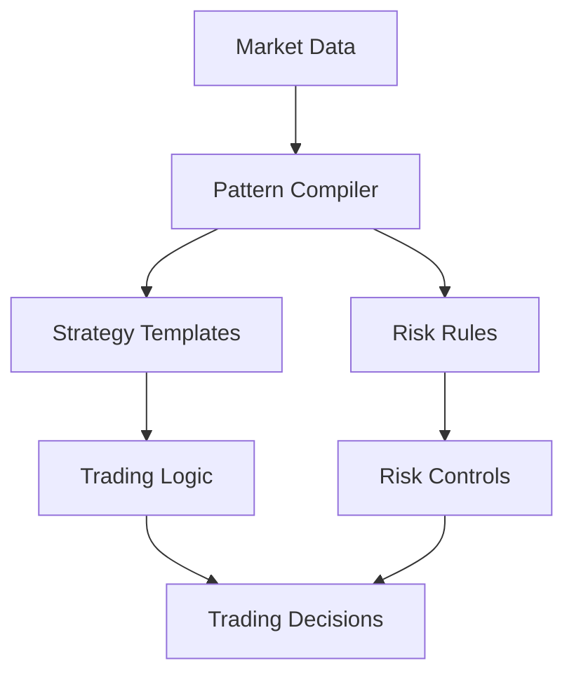
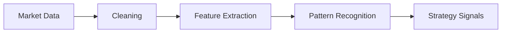
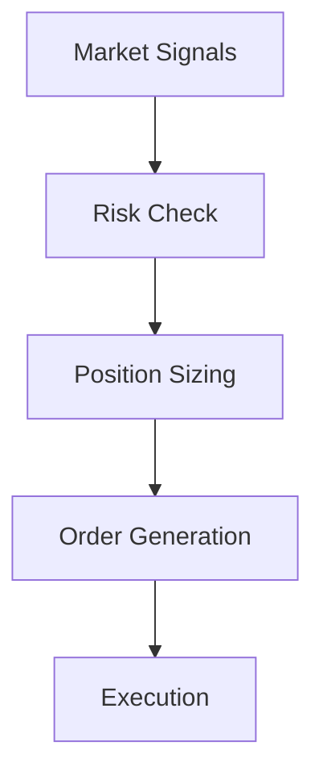
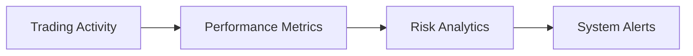

# Finance Applications: Algorithmic Trading Strategies

## Overview
Implementation of Local Logic compilation for financial trading systems, focusing on pattern recognition and strategy optimization.

### Key Components
- Market pattern extraction
- Trading strategy compilation  
- Risk management rules
- Real-time decision making



## Implementation Details

### 1. Pattern Recognition
- Price action patterns
- Volume analysis
- Technical indicators
- Market sentiment signals

### 2. Strategy Compilation
- Entry/exit rules
- Position sizing logic
- Market condition filters
- Multi-timeframe analysis

### 3. Risk Management
- Position limits
- Stop-loss rules
- Portfolio exposure controls
- Drawdown management

### 4. Real-Time Processing
- Market data streams
- Order execution logic
- Position monitoring
- Performance tracking

## Configuration

### Basic Setup
```python
config = {
    'timeframes': ['1m', '5m', '15m', '1h', '4h', '1d'],
    'max_positions': 10,
    'risk_per_trade': 0.02,  # 2% per trade
    'max_drawdown': 0.15     # 15% maximum drawdown
}
```

### Advanced Parameters
```python
risk_rules = {
    'position_sizing': {
        'method': 'risk_based',
        'max_risk_per_trade': 0.02,
        'account_risk_limit': 0.05
    },
    'exposure_limits': {
        'single_asset': 0.20,
        'asset_class': 0.40,
        'total_portfolio': 0.80
    }
}
```

## Performance Metrics

### 1. Trading Performance
- Win rate
- Profit factor
- Sharpe ratio
- Maximum drawdown
- Recovery factor

### 2. Risk Metrics
- Value at Risk (VaR)
- Expected Shortfall
- Beta exposure
- Correlation analysis

### 3. Execution Quality
- Slippage analysis
- Fill rates
- Order latency
- Implementation shortfall

## Best Practices

### 1. Strategy Development
- Start with simple patterns
- Test across market conditions
- Validate with historical data
- Monitor live performance

### 2. Risk Controls
- Implement multiple layers
- Use dynamic position sizing
- Monitor correlation risks
- Set clear exit criteria

### 3. System Monitoring
- Track system health
- Monitor data quality
- Log all decisions
- Review performance regularly

## Common Issues

### 1. Pattern Recognition
- False positives in noisy markets
- Delayed pattern detection
- Overfitting to historical data
- Missing key market shifts

### 2. Risk Management
- Position sizing errors
- Stop-loss violations
- Exposure limit breaches
- Drawdown control failures

### 3. Execution
- High slippage
- Poor fill rates
- System latency
- Data quality issues

## Advanced Topics

### 1. Machine Learning Integration
```python
def train_pattern_recognition(historical_data):
    """Train pattern recognition model"""
    features = extract_features(historical_data)
    model = compile_local_logic(features)
    return model

def optimize_strategy(model, market_conditions):
    """Optimize strategy parameters"""
    params = analyze_conditions(market_conditions)
    return update_strategy_rules(model, params)
```

### 2. Portfolio Optimization
```python
def optimize_portfolio(positions, risk_limits):
    """Optimize portfolio allocation"""
    exposure = calculate_exposure(positions)
    return rebalance_positions(exposure, risk_limits)
```

### 3. Market Microstructure
```python
def analyze_microstructure(order_book_data):
    """Analyze market microstructure"""
    liquidity = assess_liquidity(order_book_data)
    return adjust_execution_strategy(liquidity)
```

## System Architecture

### 1. Data Processing Pipeline


### 2. Decision Engine


### 3. Monitoring System


## Deployment Guidelines

### 1. Infrastructure Setup
- High-availability systems
- Low-latency connections
- Redundant data feeds
- Backup execution paths

### 2. Testing Requirements
- Unit tests for components
- Integration testing
- System stress testing
- Disaster recovery plans

### 3. Monitoring Setup
- Real-time dashboards
- Alert systems
- Performance tracking
- Risk monitoring

## Future Developments

### 1. Enhanced Pattern Recognition
- Deep learning integration
- Alternative data sources
- Real-time pattern adaptation
- Market regime detection

### 2. Advanced Risk Management
- Dynamic risk allocation
- Cross-asset correlation
- Tail risk protection
- Adaptive position sizing

### 3. System Optimization
- Hardware acceleration
- Network optimization
- Execution algorithms
- Decision latency reduction
