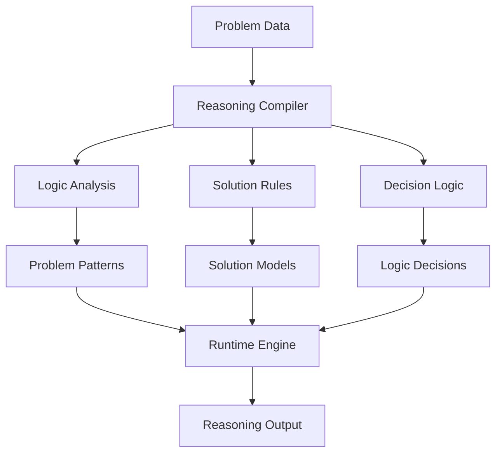

# Reasoning System Compilation

## Overview
Implementation of Local Logic for problem-solving and decision support, demonstrating the system's ability to compile complex reasoning patterns into efficient local models.

## Implementation Details

### Pattern Analysis
- Problem pattern recognition
- Solution path identification
- Decision tree modeling
- Logic optimization

### Reasoning Compilation
- Solution strategies
- Decision templates
- Logic models
- Outcome optimization

### Runtime Processing
- Real-time problem analysis
- Quick solution generation
- Dynamic logic application
- Rapid decision making

## Key Benefits
1. **Efficient Processing**
   - Quick problem analysis
   - Rapid solution generation
   - Low computational overhead

2. **Reasoning Depth**
   - Complex logic in simple rules
   - Context-aware solutions
   - Outcome-optimized decisions

3. **Adaptability**
   - Pattern updates
   - New logic integration
   - Quick strategy adjustments
